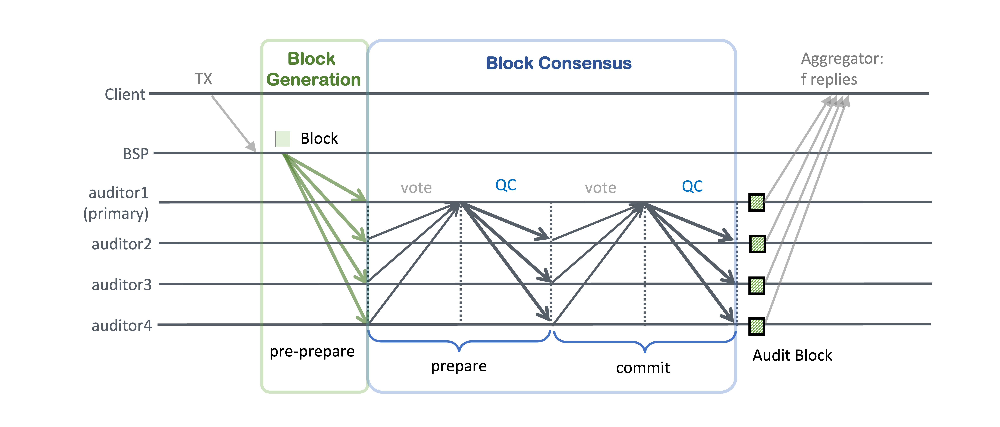

# Code-deploy-AWS-EC2

## Intro
This repository is the automated code for AWS Cloud deployment and performance measurement of AuditChain, a private blockchain system.

## About AuditChain: a Private Blockchain Platform 
AuditChain is a private blockchain system using PBFT-like consensus with linear communication complexity, assuming a partially synchronous network. While the traditional PBFT consensus algorithm is monolithic, block generation steps are separated from the consensus layer in AuditChain.

  
  <figcaption>Fig 1. AuditChain architecture consists of three components: a client, a BSP, and auditors.</figcaption>

As shown in Fig 1, AuditChain has two types of nodes: A Block Service Provider (BSP) and consensus nodes called auditors. BSP is responsible for creating blocks, while auditors forming a consensus network are responsible for agreement on blocks received from the BSP. 

  
  <figcaption>Fig 2. Message pattern of AuditChain</figcaption>

The consensus algorithm shown in Fig 2 is like PBFT but with linear O(n) communication complexity. The difference with PBFT is that it is linearized and has an additional node, BSP, as a static block producer.

## Deployment Setup on Amazon EC2
I deployed AuditChain on AWS EC2 as shown in the table below. We also deployed client servers for performance evaluation and evaluated performance according to the workloads below.

  
  <figcaption>Table 1. 2Message pattern of AuditChain</figcaption>

**Workload**. Performance (throughput, latency) is measured for 1 minute after the first 30 seconds after the test starts. We use the Hyperledger Caliper benchmarking tool to test the performance. In Every test, for a total of 2 minutes, the client submits a SendPayment transaction to BSP. When referring to latency, we mean the time elapsed from the client submits the transaction to the client receives the f+1 commit events from auditors. 

## Two scenarios
We run our experiments on two scenarios: a local-distributed scenario, where every node is deployed in the Seoul region, and a global-distributed scenario, where auditor nodes are distributed across two AWS regions: Seoul (ap-northeast-2), N.Virginia (us-east-1).

  
&nbsp; &nbsp; &nbsp; &nbsp;
  

