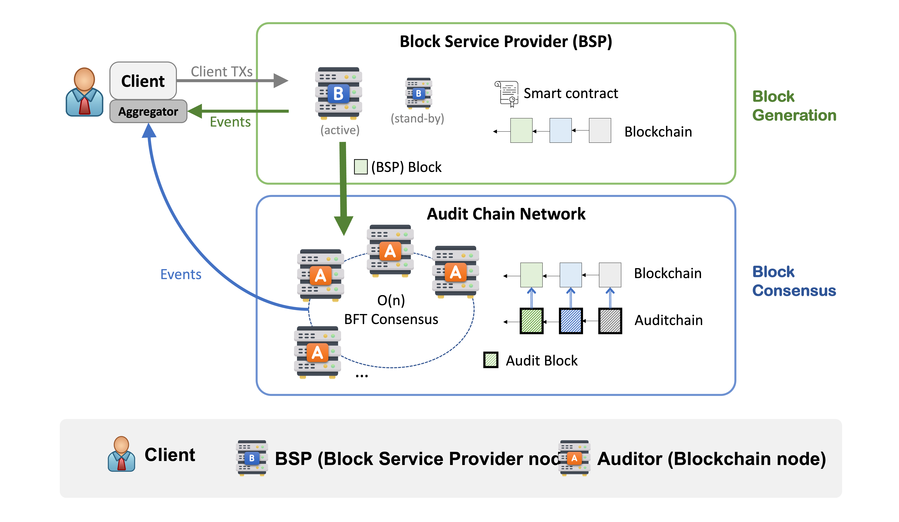
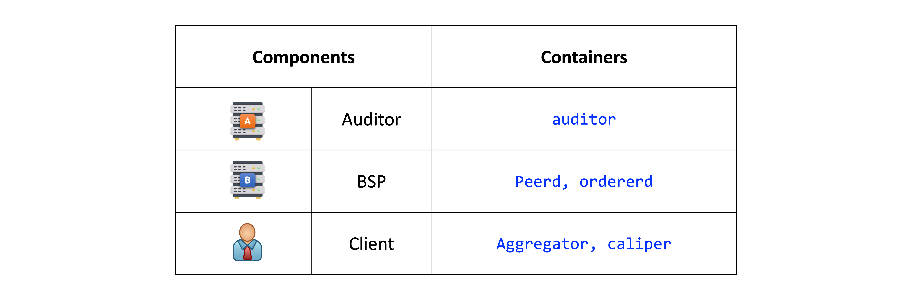
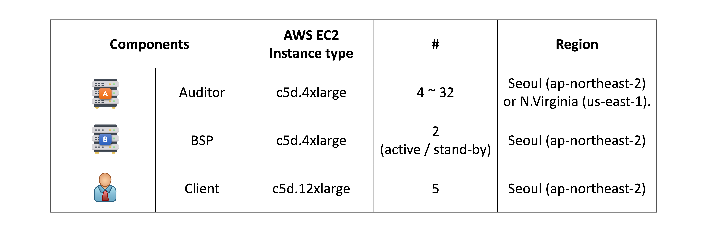

# Code-deploy-AWS-EC2

## Intro
This repository is the automated code for AWS Cloud deployment and performance measurement of AuditChain, a private blockchain system.

## About AuditChain: a Private Blockchain Platform 
AuditChain is a private blockchain system using PBFT-like consensus with linear communication complexity, assuming a partially synchronous network. While the traditional PBFT consensus algorithm is monolithic, block generation steps are separated from the consensus layer in AuditChain.

  
  <figcaption>Fig 1. AuditChain architecture consists of three components: a client, a BSP, and auditors.</figcaption>

> 🙂 For more information, Please check [this repository](https://github.com/Haneul-Oh/Auditchain). 🙂 

## Components of Implementation
Each component was developed by containerization according to its function and is composed as follows.

  

## Deployment Setup on Amazon EC2
We deployed AuditChain on AWS EC2 as shown in the table below. We also deployed client servers for performance evaluation and evaluated performance according to the workloads below.

  

### Workload
Performance (throughput, latency) is measured for 1 minute after the first 30 seconds after the test starts. We use the Hyperledger Caliper benchmarking tool to test the performance. In Every test, for a total of 2 minutes, the client submits a SendPayment transaction to BSP. When referring to latency, we mean the time elapsed from the client submits the transaction to the client receives the f+1 commit events from auditors. 

### Two scenarios
We run our experiments on two scenarios: a local-distributed scenario, where every node is deployed in the Seoul region, and a global-distributed scenario, where auditor nodes are distributed across two AWS regions: Seoul (ap-northeast-2), N.Virginia (us-east-1).

  
  

